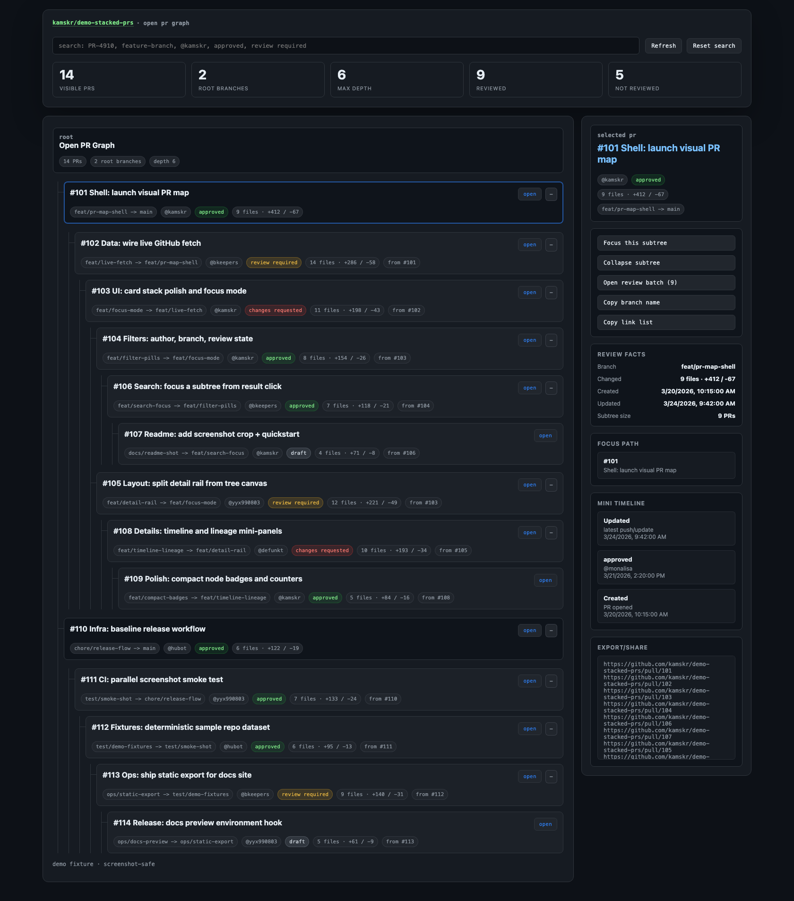

# gh-pr-visualizer

Visualize open pull requests as a branch tree.

Useful when a repo has lots of open PRs and some of them are stacked on top of each other.
Instead of asking:

- which PR depends on which
- which branch should be reviewed first
- whether another branch needs to be synced before merge

you get a quick graph of the actual branch structure.



## What It Solves

In bigger projects, stacked PRs get messy fast.

- review order gets unclear
- dependency chains live in Slack messages or PR comments
- it is easy to miss that one PR is based on another feature branch instead of `main`
- reviewers and authors waste time figuring out what needs to land or sync first

This tool pulls open PRs, infers parent/child relationships from `baseRefName` and `headRefName`, and renders the stack as a tree so you can inspect the structure at a glance.

## Usage

Live GitHub data:

```bash
node pr-tree.js
```
